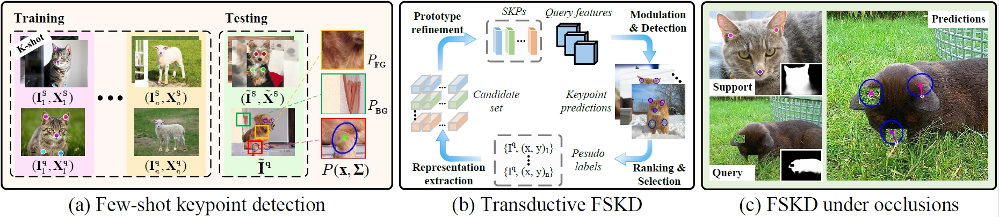

# VPViT
## 1. Introduction
- This repositary is the official implementation for the paper [Exploiting Class-agnostic Visual Prior for Few-shot Keypoint Detection](). 
- **TL;DR:** A suite of novel methods for few-shot keypoint detection (FSKD), including the visual prior guided vision transformer (VPViT), transductive FSKD, and masking and alignment (MAA), are proposed to enhance keypoint representation learning. The role of VPViT aims to capture the foreground patch relations for keypoint detection. The transductive FSKD is to enhance keypoint representations with unlabeled data and the MAA is investigated to improve detection robustness under occlusions. 
- Tasks handled by our model:
 

## 2. Requirements
- Python 3.10
- Pytorch 1.12

## 3. News and upcoming updates

- [x] We initiated the process to open-source codes & models
- [ ] ***We will release the source code of VPViT & VPViT based FSKD upon the acceptance of our paper***
- [ ] ***We will release our trained models*** 

<!-- ## Citation
If you find our ideas interesting and helpful in your research, please cite our paper. Many thanks!

```
@inproceedings{lu2022few,
  title={Few-shot keypoint detection with uncertainty learning for unseen species},
  author={Lu, Changsheng and Koniusz, Piotr},
  booktitle={Proceedings of the IEEE/CVF Conference on Computer Vision and Pattern Recognition},
  pages={19416--19426},
  year={2022}
}
``` -->

## 4. Contact

 * Raise a new [GitHub issue](https://github.com/AlanLuSun/VPViT/issues/new)